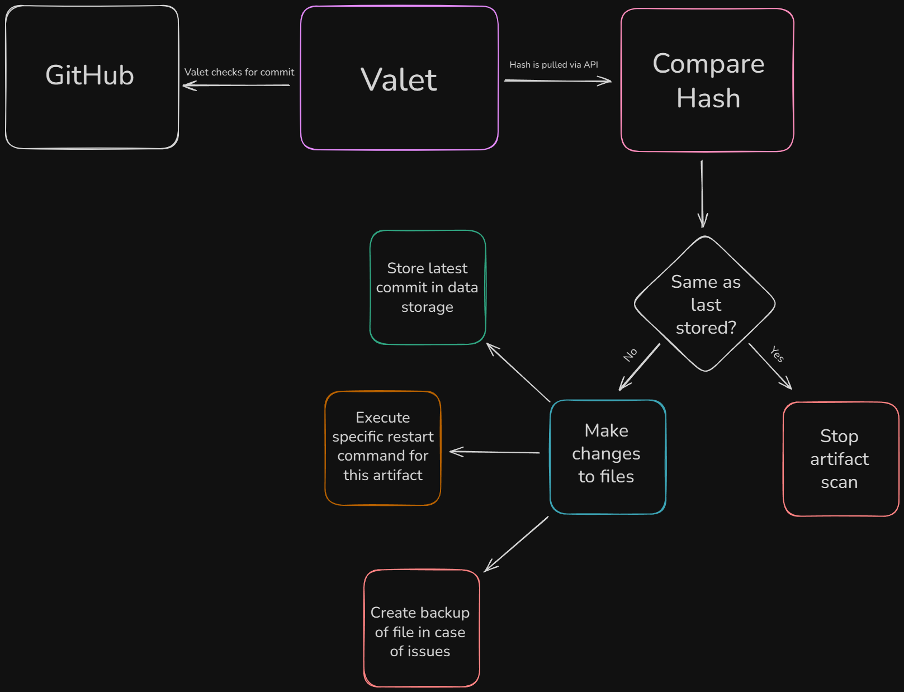

# 🚄 Valet

<div align="center">

**A Vercel-like deployment system that automatically syncs your GitHub repositories to your own machine**

[](https://kotlinlang.org/)
[](LICENSE)
[](https://docs.github.com/en/rest)

[Features](#-features) • [Installation](#-installation) • [Configuration](#-configuration) • [Usage](#-usage) • [Contributing](#-contributing) • [Demo](https://www.youtube.com/watch?v=ypx7gZAG-nk)

</div>

---

## ✨ Features

<table>
<tr>
<td>

### 🎯 **Incremental Updates**
Only fetches files that have changed in the latest commits, saving bandwidth and time.

</td>
<td>

### ⚡ **Lightning Fast**
Efficiently syncs repositories using GitHub's API with smart caching.

</td>
</tr>
<tr>
<td>

### 🔄 **Auto-Sync**
Monitors for changes and deploys automatically in 3 minute intervals.

</td>
<td>

### 🛡️ **Secure**
Supports GitHub token authentication for private repositories.

</td>
</tr>
<tr>
<td>

### 📦 **Easy Setup**
Simple JSON configuration with template artifacts.

</td>
<td>

### 🌈 **Pretty CLI**
Colorful console output for better visibility.

</td>
</tr>
</table>

---

## 🎬 Quick Start

```bash
# Download the latest release
wget https://github.com/98ping/valet/releases/latest/download/valet.jar

# Run Valet
java -jar valet.jar
```

On first run, Valet will create a `configuration.json` file. Edit it with your repository details and restart.

---

## 📦 Installation

### Prerequisites

- Java 21 or higher
- GitHub Personal Access Token (for private repos)

### Building from Source

```bash
# Clone the repository
git clone https://github.com/98ping/valet.git
cd valet

# Build with Gradle
./gradlew shadowJar

# Run the application
java -jar build/libs/valet-1.0-SNAPSHOT.jar
```

---

## ⚙️ Configuration

Valet uses a simple JSON configuration file to store artifacts:

```json
{
  "id": "template",
  "location": "/home/Template",
  "owner": "98ping",
  "repo": "Valet",
  "branch": "master",
  "filters": {
    "include": ["src/**/*.kt", "*.md"],
    "exclude": ["*.tmp", "build/"]
  },
  "restartCommand": "./start.sh"
}
```

### Configuration Options

| Option            | Type                | Description                                       |
|-------------------|---------------------|---------------------------------------------------|
| `id`              | String              | The name of your artifact                         |
| `owner`           | String              | Repository owner/organization                     |
| `repo`            | String              | Repository name                                   |
| `branch`          | String              | Branch to track (default: `main`)                 |
| `targetDirectory` | String              | Local directory to sync files to                  |
| `filters`         | Map<String, String> | Defines what files to include and ignore          |
| `restartCommand`  | String              | What should be ran after the deployment concludes |

---

## 🎯 Usage

### Basic Usage

```bash
java -jar valet.jar
```

## 🏗️ How It Works



1. **Monitor**: Valet continuously checks for new commits
2. **Analyze**: Identifies added, modified, and removed files
3. **Sync**: Downloads only changed files via GitHub API
4. **Deploy**: Updates your local directory with the latest changes

---

## 🤝 Contributing

We welcome contributions! Here's how you can help:

1. 🍴 Fork the repository
2. 🔧 Create a feature branch: `git checkout -b feature/amazing-feature`
3. 💾 Commit your changes: `git commit -m 'Add amazing feature'`
4. 📤 Push to the branch: `git push origin feature/amazing-feature`
5. 🎉 Open a Pull Request

---

## 📊 Project Stats

<div align="center">


</div>

---

## 📝 License

This project is licensed under the MIT License - see the [LICENSE](LICENSE) file for details.

---

## 🙏 Acknowledgments

- Built with [Kotlin](https://kotlinlang.org/)
- Powered by [GitHub API](https://docs.github.com/en/rest)
- Inspired by [Vercel](https://vercel.com/)

---

<div align="center">

**Made with ❤️ by Matrix Studios**

[Report Bug](https://github.com/98ping/valet/issues) • [Request Feature](https://github.com/98ping/valet/issues)

</div>
